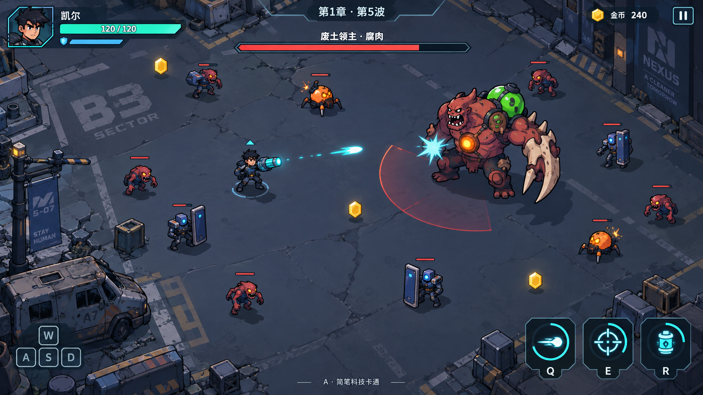
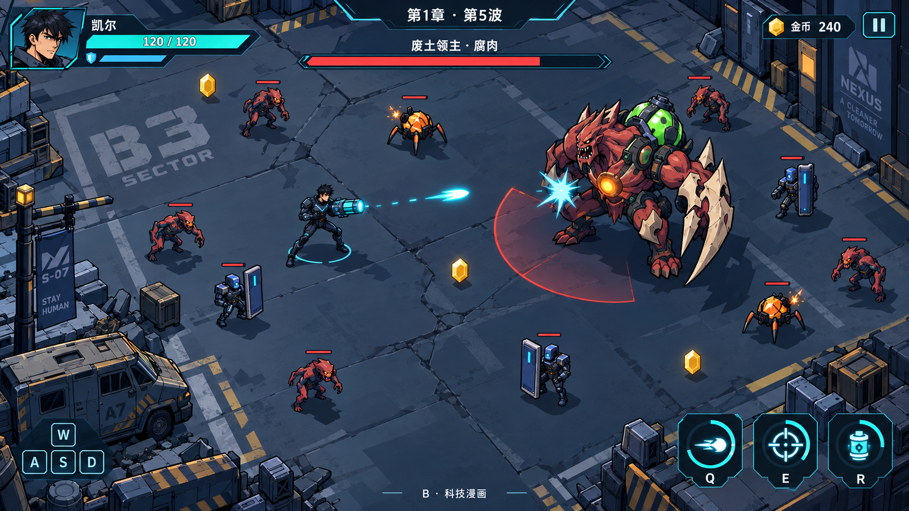

# Hexblast 画风重构方案：A 的造型与画面，B 的亮度

日期：2026-09-30。状态：实施中（六章各两套场地与 UI 第一批已入库）。

### 2026-09-30 首批实施记录

- 已入库：新标题背景；第 1–4 章同名底图重绘；第 5、6 章新增底图并接入 `WaveData`；13 张独立透明残骸及六章各两套布局。
- 已接入：角色滑动碰撞、普通敌人/Boss 局部绕行与出生落点、友敌弹体扫掠、高大残骸视线阻挡、拾取物合法落点；标题、存档、大厅、地图、难度、选人、HUD、强化与商店等第一批共用面板和色板。
- 已核验：Cocos Creator 3.8.8 Web Desktop 构建；1280×720 实际切换六章并逐章截图，首章两套布局及第 2–6 章两套布局的随机样本已观察；首章空场约 57–61 FPS，其他章节空场约 51–61 FPS；密集刷怪截图约 59–61 FPS；12 项场地测试和 TypeScript 类型检查通过。13 张残骸有真实 alpha，新增 `.meta` 由 Creator 导入。
- P0a 造型候选：已生成并收简[凯尔侧面设计图](style-a/design-masters/kai-side-candidate.md)，核验透明通道和 82px 预览；尚未进行正式拆图、绑定或动作替换。
- 尚需：凯尔与敌方单位的 A 风格设计基准及分层动画；各 Boss、特殊技能和完整页面往返实测；其余页面的可读性细修。当前完整测试集 481 项中 466 通过、15 项历史数据/脚本断言失败，需单独修复后再宣称全绿。

### 2026-09-30 地图与页面追加核验

- 第一章岗哨和第 2、3、5、6 章侧边设备按实机画面加宽了背景建筑碰撞；首章角色向左停在岗哨箱体右侧。六章独立残骸按 PNG 实体像素上沿计算角色脚底安全距离，普通敌人与大型 Boss 的绕行测试均通过。
- 背景、实体与残骸同步震屏。Web Desktop 画布在 1600×720 铺满窗口，中央 1280×720 底图仍与碰撞坐标对齐；两侧用无碰撞的镜像场景延伸。1280×720 实机确认首章高残骸和矮路障的脚底停步，1600×720 实机确认宽屏无黑边与无硬接缝。
- 测试房海克斯授予页由 23 张卡四行挤压改为每页 6 张、共 4 页；长说明采用 13px 字号与独立阅读区。实机确认第 1、4 页、翻页和授予后的卡片状态。此轮 Cocos 构建、类型检查、场地测试 12/12、测试房测试 32/32、视觉 UI 测试 36/36 通过。
- 宽屏首页、存档、大厅、任务树、图鉴、成就页逐页实测；修正了直接进入任务/图鉴/成就时两侧露黑边的问题，这三页的背景会随可见宽度与窗口变化重排。成就卡说明与进度字号提高，任务页不再向玩家显示“占位数据”。
- 2026-10-01 边缘实走复查：在 1600×720 的第二章右上管线和第六章右上反应堆支柱，角色从下方向上走时会踩入底座。分别补上仅覆盖右侧底座的阶梯形碰撞，保留建筑左侧通路；切换章节时把玩家移到新布局的合法位置。背景建筑上沿也使用玩家脚底余量，避免从上方踩进岗哨和遗迹。Cocos Web Desktop 重新构建后，实走确认两处右侧底座、第一章岗哨与第四章遗迹均能挡住角色；场地测试 14/14、类型检查通过。全量测试 481 项中 466 通过、15 项仍为原有失败。
- 1600×720 页面复查发现设置弹窗两行音量标签压到滑杆；已拉开间距，重新构建并在首页与战斗暂停入口查看。测试房相关测试 32/32 通过。
- 动态扩窗复查发现浏览器 canvas 已到 1600px，但 Cocos 渲染窗口仍为 1280px，页面停在左侧并露黑条。现由 `ScreenFit` 在尺寸不一致时同步渲染窗口，首页、存档、大厅和设置页随可见宽度重排背景及遮罩；Web Desktop 重建后实测 1280→1600 扩窗的设置、存档、大厅和战斗画面均铺满且居中。类型检查、视觉 UI 测试 36/36 通过；全量测试仍为 466/481，通过数未退步。
- 正式入口从首页依次进入存档、大厅、地图、难度、选人和第一章战斗，第一波清场后进入波间海克斯商店；从商店继续第二波并打开暂停页，实测波间和暂停状态为 `augSelect`、`paused`，属于正常流程。1600×720 截图复查后提高了难度说明、卡片操作提示和未解锁地图/角色条件的亮度；锁定角色姓名置于遮罩之上，保留锁定状态区分。最新 Web Desktop 构建实测选人页，战斗→暂停→退出可回大厅；类型检查与视觉 UI 测试 36/36 通过。
- 底图再对齐发现第一章左下废车车头、第二章右上熔炉前沿、第六章右上反应堆碎石超出原边界，角色在对应画面上仍可通行。已各补一段阶梯形实体边界，并在 Cocos Web Desktop 1600×720 实际停步截图核对；旁边通路保留。全布局连通性检查又发现第三、五、六章第二套布局有大型单位可能卡住的边缘窄区；移动对应独立残骸后，三套画面实机复查、12 套布局的普通及大型单位区域连通。场地测试 16/16、类型检查通过；全量测试新增 2 项场地用例后共 483 项，468 通过、15 项仍为原有失败。
- 任务树、图鉴、成就页在 1600×720 再次逐页截图复查，内容和返回入口均完整。失败与章节通关改为共用行动报告：显示当前章节/波次、击败、最高连击、获得金币和积分，状态色与按钮文案随结果变化；1280×720、1600×720 实机截图均确认。最终章清场时立即写入胜利档案，直接返回大厅也不会漏记；隔离的浏览器存档验证 `totalWins=1` 后已恢复。最新 Cocos 构建、类型检查、视觉 UI 测试 36/36 通过；全量测试 468/483，原有 15 项失败未增加。
- 属性页 1600×720 实测发现技能名称受默认行高影响缩得过小，说明与名称也贴得过近；已分行增加阅读空间并固定行高，宽屏遮罩同步覆盖两侧。右栏空状态显示说明，最多 10 条强化仍按两列五行展示；底板和词条卡改为共用科幻面板，隐藏后重新打开会重绘。1280×720 与 1600×720 实机复查、Cocos 构建、类型检查及视觉 UI 测试 36/36 通过；全量测试仍为 468/483，原有 15 项失败。
- 波间普通商店把名称与说明分行，说明提高到 13px，商品行改共用科幻面板并在二级弹窗返回后重绘。购买按钮随金币变化显示「购买／金币不足／已售出」；海克斯商店刷新和卡片也直接显示余额不足。两页遮罩按可见宽度铺满；1600×720 实测 0 金币、购入后余额变化、神秘强化进入与返回、1280→1600 扩窗。最新 Cocos Web Desktop 构建、类型检查、视觉 UI 测试 36/36 通过；全量测试 468/483，仍为原有 15 项失败。
- 测试房底部工具条原先只绘制 1280px，宽屏两侧露出场地；现按可见宽度铺满。英雄/海克斯浮层的遮罩触摸区域移到屏幕中心并随窗口伸缩，点击上方或侧边空白可关闭。两种浮层底板和卡片统一为科幻面板，授予页名称固定行高并增大字号；退出兜底页也铺满宽屏。Cocos Web Desktop 在 1280×720、1600×720 实测浮层、扩窗和点击关闭；类型检查、相关测试 68/68 通过，全量测试仍为 468/483（15 项原有失败）。
- 六章背景与边缘碰撞框叠加复查后，实走复现第二章炉台左右外凸管线、第四章右上传送门底座及左下遗迹、第五章左下机械、第六章左右核心碎块的脚底压入。按视觉实体补七段阶梯形边界，第六章左下又加宽到碎块外沿；相同路线在 Cocos Web Desktop 1600×720 复拍，角色已停在对应实体外。全部 12 套布局的普通/大型单位通路检查保持通过；场地测试 17/17、类型检查和 Web Desktop 构建通过，全量测试 469/484，仍为原有 15 项失败。
- 第一章两套布局的六个独立残骸逐一从上方向下行走并截图复查，角色脚底均停在可见实体之前。原场地测试对北侧残骸从顶部边界内起步，可能不移动也通过；现从合法位置起步，断言确实走到残骸、脚底不压入且不会过早停步。少数嵌在背景建筑下的北侧残骸由建筑边界封住上方入口，测试明确识别这一情况。场地测试 17/17、类型检查通过。
- 将资源清单测试的海克斯数量校准为现有 23 个，并把完整主线及无尽测试校准为六章 30 波、无尽从第 31 波开始；补齐兽潮测试缺失的模拟玩家导入。场地、资源清单和波次测试合计 36/36 通过，类型检查通过；全量测试余 12 项失败，主要涉及另行暂缓的英雄、Boss 与技能行为。
- 全局界面接入项目内简体中文字体 `NotoSansSC-Regular.ttf`：从 [Noto Sans CJK 官方仓库](https://github.com/notofonts/noto-cjk) 的 SC 可变 TTF 固定到 400 字重，保留完整 30,890 个字符映射及 [OFL 1.1](../../assets/resources/fonts/OFL.txt) 许可文本。`LabelUtils` 异步载入后更新当前节点树，随后新建标签也沿用同一字体。Cocos Web Desktop 构建通过；1280×720 首页、1600×720 首页与测试房截图无文字裁切，运行时检查 529 个 Label 均已绑定该字体。
- 全页面字号实测发现选人卡姓名被 `SHRINK` 从 20px 缩成 13px，英雄介绍的四个技能标题从 19px 缩成 12px；根因是单行标签默认行高超过了 26px 容器。设置明确行高并加高阅读区后，六张卡姓名均以 20px 显示、锁定条件保持至少 16px、四个技能标题均以 19px 显示；1280×720 实机截图复查四名可选角色的介绍。角色介绍遮罩和触摸范围现随可见宽度重画，1600→1280 扩窗/还原时实际宽度分别为 1600/1280。Cocos Web Desktop 构建、类型检查和视觉 UI 测试 36/36 通过，全量测试 472/484（余 12 项既有失败）。
- 1600×720 实机复查任务、图鉴、成就与设置页，面板均铺满可见宽度，活动文字没有自动缩字。第三章左下培养罐的横向底座可被角色脚底踩入；补一段只覆盖外凸部位的阶梯形边界后，同路线停止坐标由 x=175 移至约 x=209，可见脚底落在底座之外。Cocos Web Desktop 重建、场地测试 18/18、类型检查通过；12 套布局的普通/大型单位站立区连通检查仍通过。
- 1600×720 进一步切换任务树支线/挑战分支和图鉴分类，页面卡片、详情与字号正常。锁定任务的详情原会显示内部“占位目标”等文案；现隐藏未公开的目标、进度和奖励，第四张支线卡改为“机密委托”，重新选择进行中任务时正常恢复数值和青色状态。Cocos Web Desktop 重建后实测锁定/进行中切换；场地、任务数据、视觉 UI 相关测试 58/58、类型检查通过。
- 地图、难度、选人三页原本只铺纯深色底，与大厅和档案页的远景风格不连续。现共用压暗的第一章场景远景与页头光带，可见宽度变化时背景、遮罩和面板同步重排。Cocos Web Desktop 在 1600×720 逐页截图、1280×720 选人页截图复查，三页面板和远景实际宽度均与窗口一致；点击地图卡进入难度页、点击返回回到大厅正常。类型检查和 Web Desktop 构建通过；全量测试 473/485，12 项失败仍为既有英雄、Boss 与技能相关用例。
- 地图与难度大卡接入共用悬停、按下和禁用外观。卡片缩略图与文字会截走父节点的鼠标进入事件，因此补顶层透明命中区，让整卡反馈一致；锁定的深海卡既不高亮也不跳转。1280×720 实机测得可选卡悬停缩放 1.012、按下 0.99，进入下一页和返回正常；再次打开地图页时恢复 1.0，不残留高亮。Cocos Web Desktop 构建、类型检查与视觉 UI 测试 36/36 通过。
- 六章左上建筑沿同一路线复拍，第二、三、六章补边后角色脚底均停在炉台、培养罐和支架碎石外。右上边缘逐章实走发现第六章反应堆碎石原矩形碰撞多封住一段可见空地；改为左右两段阶梯边界，保留右侧碎石下沿。1600×720 Cocos Web Desktop 实走，角色沿 y=180 从 x=650 走到 x=902 后停在碎石外，原边界在 x=770 即停止。场地测试 20/20、类型检查和 Web Desktop 构建通过。
- 六章右下背景边缘再按 y=560 实走，第一、三、四、五、六章的箱体、实验室设备、遗迹、装甲平台和核心碎石原停步点让角色脚底贴上可见底座。五处各补一段局部外凸边界；第四章边界上沿下移，保持传送门附近的敌人绕行。Web Desktop 在 1600×720 按同一路线逐章复拍，停步点分别为 x≈1050、1062、991、1038、956，脚底位于实体外。场地测试 21/21、类型检查和构建通过；全量测试 476/488，12 项既有英雄、Boss、技能及经济用例仍失败。
- 存档选择页三张档案卡补齐悬停和按下反馈，保留文字独立节点与删除按钮的独立操作。1600×720 Cocos Web Desktop 实测卡片缩放依次为正常 1、悬停 1.012、按下 0.99，松开恢复悬停；删除首次点击只进入确认态，不触发选档；隐藏后重新打开恢复正常缩放与按钮状态。类型检查、视觉 UI 测试 36/36 和 Web Desktop 构建通过。
- 地图选择页的主线卡原只展示第一章，未开放的“深海”卡却借用了第三章实验室底图。现由 `WaveData.CHAPTERS` 绘制六章真实场景的 3×2 缩览，并将深海卡改为明确的雷达占位；页头说明六章是依次展开的独立战场。Cocos Web Desktop 1280×720、1600×720 画面复查，六张背景均实际加载；锁定卡点击不进入下一页，可选卡仍进入难度流程。类型检查、视觉 UI 测试 36/36 和构建通过。
- 六章 13 类独立残骸再次从正上方向下实走，逐张等待渲染帧完成后核对角色脚底与素材实体上沿。断墙、废车、路障、压机、传送带、培养罐、控制台、传送门、石柱、机械、轨道、反应堆和支架均停在可见建筑前；同时确认选人页“选择出战”按钮在真实鼠标悬停时呈现预期的 1.025 倍反馈。此轮是已提交构建的运行画面复核，没有改动碰撞数据。
- 共用按钮皮肤复现离开页面时悬停缩放残留：选人页“选择出战”按钮从 1.025 倍离开再返回仍是 1.025。激活时现在重置为正常或禁用状态，并重绘皮肤；Cocos Web Desktop 重建后同一路径实测悬停 1.025、重新进入 1.0。类型检查、场地测试 21/21 通过。
- 地图选择页的六张实际场景缩图补齐编号和章节名，名称直接来自 `WaveData.CHAPTERS`，不再只能靠小图与序号辨认。Cocos Web Desktop 1280×720 等待六张 SpriteFrame 加载后截图确认文字完整；点击任一主线缩图仍进入难度页，点击锁定的深海卡仍停留地图页。类型检查与构建通过。
- 六章背景与边缘碰撞叠图再核对，实走复现第五章左侧装甲墙的顶面可被角色脚底压入：y=390 从中央向左移动，旧停步 x=160。只给外凸墙体补一段局部边界后，同路线停在 x=196，Cocos Web Desktop 1280×720 截图确认脚底在实体外；y=300 的上方通路保留。六章 12 套布局的普通/大型单位连通性仍通过，场地测试 22/22、类型检查和构建通过。
- 同路线逐章复查时，第四章左侧立柱与左下遗迹之间的 y=430 空档允许角色走到 x=76，脚底落在石台上。补过渡碎石边界后实机停在 x=172；边界上沿缩至 y=430、立柱下沿接到 y=395，并将第二套布局的北侧传送门右移 10px，避免大型单位通路被封。两套布局普通/大型单位连通与绕行保持通过；场地测试 23/23、类型检查和 Cocos Web Desktop 构建通过。
- 六章右侧中段 y=390 实走均停在可见地面。第二章下方 y=450 另发现炉台传送带斜坡可踩：旧停步 x=1200，角色脚底压在橙色设备上。沿画面斜坡补两段局部边界后，Cocos Web Desktop 1280×720 实测 y=450 停在 x=1152、y=420 停在 x=1188，脚底均在设备外；上方地面仍可走。场地测试 24/24、类型检查和构建通过。
- 全局页面逐页读取运行时 Label 的实际字号，发现存档页和成就页的双语页头辅助标签由设定 12px 被挤到 11px。两处页头容器宽度从 170 增至 240；Cocos Web Desktop 1280×720 复查，实际字号分别为 13px 与 12px，标题、返回入口和卡片未受遮挡。视觉 UI 测试 36/36、类型检查与构建通过。
- 成就墙从四列三行窄卡改为三列四行宽卡，名称、条件、奖励和进度分别提高到 19/15/14/12px，稀有度图例也放大。Cocos Web Desktop 在 1280×720 与 1600×720 截图复查，12 张卡片全部完整显示，运行时 60 个卡片标签均保持设定字号；类型检查、视觉 UI 测试 36/36 与构建通过。完整测试 479/491，通过数相对新增用例后的上一轮增加，剩余 12 项仍为既有经济、英雄、Boss 与技能失败。
- 第六章左侧断框与下方核心之间再次实走：y=430 原停步 x≈184，玩家脚底站到灰色碎石上；y=450 原停步 x≈244，也贴进碎石边缘。按画面外沿补两段阶梯边界，Cocos Web Desktop 第一套布局复拍两条路线均停在 x≈268，脚底落在建筑右侧地面；两套布局的普通/大型单位区域仍连通。场地测试 25/25、类型检查和构建通过；完整测试 480/492，余下 12 项既有失败未增加。
- 同轮将六章每隔 20px 的左右横向停步点按玩家脚底位置叠到实际背景，逐章检查边缘建筑、管线、遗迹、装甲和核心碎块；当前标记均落在可行走地面一侧，未再发现明显可踩上的外凸部位。该叠图只核对边缘横向路线，中央独立残骸的上方路线仍由前述实走与场地用例验证。
- 图鉴怪物/英雄卡片名称从 14px 提至 16px、稀有度从 11px 提至 13px；右侧样本说明从 13px 提至 16px，并同步放大副标题、特征和锁定提示。Cocos Web Desktop 在 1280×720 实测怪物、英雄、未解锁三种详情，活动标签没有缩字或遮挡；1600×720 复查背景与面板完整铺开，切换分类和选卡仍正常。类型检查、视觉 UI 测试 36/36 和构建通过。
- 任务树节点状态与右侧简报字号同步放大，正文和目标达到 16px，最长挑战目标改用 50px 双行区域。Cocos Web Desktop 1280×720 实测主线、支线、长目标挑战及锁定任务，24 个活动标签均未缩字；长目标两行完整，说明、进度和奖励互不重叠。类型检查、视觉 UI 测试 36/36 与构建通过。
- 大厅出击传送门新增 1254×1254 真透明蓝灰装甲圆环，中央透明孔透出独立 `fx_hex_ring` 能量核心；内外符文拆成 Graphics 层，用 Tween 反向旋转，核心光和粒子继续按可见帧更新。Cocos Web Desktop 1280×720、1600×720 实机确认门框与核心均加载、文字清晰；两环角度持续变化，点击门体仍进入地图页。存档概要和入口辅助字同步增大；类型检查、资源清单与视觉 UI 相关测试 40/40、构建通过。完整测试 480/492，剩余 12 项既有失败未增加。
- 战斗 HUD 实机发现生命 12px、护盾与技能名 10px 难读，生命/护盾条又贴在一起。状态面板增高并分开两条进度，生命/护盾改为 16/14px，Q/E/R 名称改为 14px、按键改为 16px；普通战斗技能环上移，避免贴近屏幕底边。Cocos Web Desktop 在 1280×720 测试房及普通布局、1600×720 普通布局复拍，运行时实际字号均等于设定值，文字未截断；类型检查、视觉 UI 测试 36/36 与构建通过。完整测试 480/492，仍为相同的 12 项既有失败。
- 属性页面对真实的 105 字“元素暴击”说明时，10 张卡中对应标签被 `SHRINK` 到 6px；另有 63 字词条缩到 9px。右栏现以 14px 两行摘要展示，每张卡可点按打开 16px 完整说明；超过 10 条时每页展示 10 条并提供上一页/下一页。Cocos Web Desktop 用 12 条测试词条在 1280×720 实测摘要实际字号均为 14px、最长详情全文 105 字保持 16px、第二页显示第 11/12 条且可打开对应详情；1600×720 复查弹层和遮罩完整。类型检查、视觉 UI 测试 36/36 和构建通过。
- 地图选择页六张章节缩图的题签原设为 12px；在实际构建中六张均按 12px 显示。改为 14px 固定字号与明确行高后，第一至第六章（含最长“海克斯实验室”）在 1280×720 实机均保持 14px、未裁字；1600×720 复查两张大地图卡和六章缩图完整。点击缩图仍可进入难度页。类型检查及 Cocos Web Desktop 构建通过。
- 第一章 `ch1-checkpoint` 的断墙、废车、路障在 1280×720 实际测试房中，从各自上方合法落点用移动输入走到停步，脚底分别停在可见实体前；三个停步中心约为 y=215、199、479。回归用例原用 18px 碰撞半径和脚底 +37px，比运行时玩家的 16px、脚底 +36px 更保守；现按运行时尺寸检验第一章三个与六章全部独立残骸，并以各 PNG 实体像素比例计算真实上沿。场地相关用例通过；完整测试仍为 480/492，12 项原有失败未增加。
- 普通商店六行商品说明从 13px 提到 16px，购买按钮加宽到 100px，让“金币不足／购买／已售出”均以 14px 单行显示。Cocos Web Desktop 1280×720 实机测得六行说明实际字号 16px、缺金币按钮 14px；刷新余额后点击商品，金币更新且按钮切换为 14px“已售出”。1600×720 复查面板、按钮和六行均完整；类型检查与构建通过。

视觉方向：**A 的角色造型、地图和 UI，B 的亮度与可读性**。动画采用分层素材、本地关节与代码动作，特殊动作补少量姿势帧。资源命名、加载、分层、测试和 Git 规则按项目约定执行。

## 1. 最终目标与执行路线

将首页、大厅、任务、图鉴、选人、战斗、商店和结算统一为 **A 的科幻动作卡通风**：圆整而结实的英雄和敌人、清楚的粗轮廓、简化的材质、适度夸张的动作与 A 的界面造型。用 B 作为**亮度和可读性参照**，使战斗场地、单位、警示、技能和文字在实际画面中更易分辨。

制作路线：**风格基准 → 单位设计基准 → 可绑定的分层素材 → 本地动作调试 → 凯尔侧面动作验证 → 第一章完整样机 → 按完整单位与章节扩展 → 全页面和全动作验收**。

GPT 图像生成负责角色设计、分层部件、地图、图标与必要的特殊姿势；文字与代码能力负责清单、拆图规范、关节数据、动作曲线、组件实现、导入和核验。重复动作在本地制作与复用；帧播放器用于特殊姿势和适合烘焙的群怪。

范围覆盖游戏中的角色、敌人、地图、页面、特效和短动画。制作顺序不改变最终覆盖范围。

### 1.1 两张参考的分工与优先级

**A：主风格参考。** 用于角色头身比例、圆整轮廓、装备简化程度、敌人设计、地图和 UI 的整体造型。



**B：亮度参考。** 用于明暗层次、主体与背景分离、文字和技能的辨识程度。



制作判定顺序：**造型与布局看 A → 明度与可读性看 B → 以真实游戏尺寸和密集战斗画面验收**。当角色、敌人或警示不清楚时，调整局部亮面和背景分离度并在实机确认。

两图用于视觉校准。正式素材按角色、地图、UI 和特效分别制作；示例中的路面文字、按键占位、怪物数量和血条数值不作为游戏内容要求。

### 1.2 当前项目基线

- 引擎：Cocos Creator 3.8.8；设计画布：1280×720；UI 与实体使用程序化节点。
- `assets/resources/art/` 当前有 466 张 PNG，其中 292 张为动画图集。文件数不等于角色数或制作调用数。
- 角色：6 名英雄。
- `BossDB.ts` 目录：16 种小兵、11 种小 Boss、10 种首领，共 37 种敌方单位；加英雄共 43 种单位。
- 炮台、分身、孵化体等召唤物另列。复用本体的分身可以共享素材；具备独立外形的召唤物需要独立验收。
- 地图：6 章，目前仅 4 张底图，第 5、6 章复用第 4 章。
- 已有 `ActorAnimation`、`ActorAnimationDB`、`EffectAnimationDB`、`SpriteUtils`、动画预览与导入工具，可继续使用。当前身体采用单条全身帧动作；上、下身独立播放需要后续新增表现层支持，不能仅靠换图片实现。

## 2. A 主风格与 B 亮度规则

| 维度 | 制作规则 |
| --- | --- |
| 镜头 | 场地沿用当前顶视战斗坐标；单位使用统一的高位三分之四视角，并提供前、侧、背方向；道具与单位透视一致 |
| 人物比例 | 沿 A 的偏短、结实人形，以约 3–4 头身为设计起点；凯尔等不能变成 B 的细长体态，也避免幼态大头；雷克、格雷夫保持各自重量感，最终按实机尺寸校准 |
| 描线 | 沿 A 的连续、稍粗外轮廓；内部结构线少而清楚；小尺寸不堆零碎装饰或尖锐细刺 |
| 明暗 | 沿 A 的简化块面，采用 B 的可读性目标：抬高中间调与关键主体的亮面，让暗部仍保留结构；统一左上主光，不能把整张图简单加曝光 |
| 装备 | A 式圆整、大块、结实的炮/甲/关节；保留功能性形状，削减高密度铆钉、刀片、尖刺和细纹 |
| 材质 | 平滑哑光装甲、简化布料、清楚的骨甲与晶体块面；少量局部纹理，避免照片感和过度锋利的漫画线 |
| 能量 | 核心、枪口和释放峰值发光；持续光效不吞没身体轮廓 |
| 场景 | 沿 A 的圆整、易辨认设施与地形；中央低纹理、中间调清楚，边缘物件表达章节主题；接触阴影与环境光统一 |
| 特效 | 枪口、弹体、命中、范围边界分层；每个特效有明确起点、峰值和结束 |
| UI | 沿 A 的紧凑科幻控件与较柔和的切角；面板、输入状态和文字达到 B 的清楚程度；少量青色强调，统一字体与间距 |

### 2.1 亮度不是全局提亮

提升角色亮面、敌人识别点、可互动元素与关键 UI 的亮度和分离度；按密集战斗画面校准场地中间调。地图中心保持低纹理，危险红区与青色弹体始终明显。

使用同样英雄、Boss、群怪密度和 1280×720 的截图验收，并检查普通笔记本显示。保留形体阴影，控制特效遮挡；不对整张底图统一加曝光。

基础建议色板（待第一章样机校准）：

| 用途 | 颜色 |
| --- | --- |
| 深背景/边缘阴影 | `#142235` |
| 面板 | `#1B3046` |
| 场地中间调起点 | `#35475D` |
| 钢灰 | `#67798F` |
| 正文 | `#EEF4FA` |
| 次要文字 | `#BBC9D7` |
| 交互/友方基础强调 | `#23D7E8` |
| 危险边界 | `#F56754` |
| 奖励 | `#FFC85C` |
| 治疗 | `#62D39C` |
| 毒素 | `#9BD65E` |

这些是美术起点和局部角色色，场地中间调也不是让背景每个像素都填同一灰蓝。它们不直接覆盖 `CharacterDB` 的身份色或战斗逻辑。六英雄保留各自识别色。敌方冰、毒、电等技能保留元素色，同时使用统一危险边界/形状提示阵营；治疗与毒素通过符号和运动方式区分。

## 3. GPT 的任务分工

| 工作 | 使用方式 | 产物 |
| --- | --- | --- |
| 制作规划 | 文字能力根据当前代码与资源清单整理 | 清单、任务卡、提示词、检查记录 |
| 角色与地图 | 内置图像生成，携带明确参考图 | 设计图、立绘、分层部件、必要特殊姿势、底图与道具 |
| 图标与特效 | 图像生成制作主要形状，本地组合与调参 | 透明 PNG、粒子纹理、必要的独立特效序列 |
| UI 设计 | 先出组件示意或页面参考，再用代码实现 | `UIStyle` 组件与真实节点布局 |
| 字体与数值 | 真实字体资源、Cocos Label | 可读、可更新的文本 |
| 动画 | GPT 制作可复用部件与特殊姿势，本地关节/骨骼和代码完成动作 | 部件图集、关节/动作数据、挂点与事件表、必要帧图集、Tween |
| 质量核验 | 文件检查、画面对照、播放与实机检查 | 接触表、动画预览、验收清单 |

后续默认使用当前可用的内置图像生成工具；无需为这条路线额外配置 API 密钥。可用工具的具体输出能力以执行时为准，记录实际使用的工具与来源，不在方案中绑定一个可能变化的模型名。

官方文档支持以参考图生成、编辑和连续迭代，同时指出多次生成的角色一致性仍可能出现问题。因此固定参考图与检查流程属于生产必需步骤。[OpenAI 图像生成文档](https://developers.openai.com/api/docs/guides/image-generation)

### 3.1 每次出图的输入包

每项任务都带上：

1. A 主风格参考图：只负责造型、轮廓、比例、材质概括和 UI/地图气质。
2. B 亮度参考图：只负责明度层次、主体与场地分离、文字和战斗信息的可读性；明确不参考其细长尖锐设计。
3. 该角色/物件已通过的设计基准：负责身份、装备与比例。
4. 当前动作或布局参考：负责姿势、方向、视角；已有素材只提供必要结构信息。
5. 单项制作目标：例如“凯尔右侧方向的近侧手臂部件，补齐肩部被遮挡区域”。
6. 输出要求：透明度、构图、部件清单、统一尺度、关节重叠区、留白；补姿势时另指定单元格和帧顺序。
7. 验收尺寸与使用场景。

明确标注各图的角色，例如“图 1 是 A 的造型与画风；图 2 仅参考 B 的亮度；图 3 是角色身份；图 4 仅参考姿势”。角色身份图只提供造型信息，材质以 A 参考为准。

每次制作重新提供稳定参考，不依赖模型记住长对话。修正时优先从已通过的基准或当前稿进行局部编辑，保留原稿，记录使用的版本。

### 3.2 小批次与修正规则

- 设计基准：每个对象先产出少量候选，选定一个可读、可动画化的版本。
- 部件制作：一个单位、一个方向、一个明确部件组一批；身体设计通过后固定尺度，只补缺件、遮挡区和确实需要的替换角度。
- 走跑、普通瞄准、后坐、轻受击和跟随动作优先修改本地数据，不向 GPT 重复请求整套动作图。
- 特殊姿势：一个单位、一个方向、一个必要动作一批；只补骨骼难以表现的透视、剪影或变形阶段。
- 不把全单位/全动作塞进一张生成大图。部件图集由已验收部件机械装箱；必要帧图集由已验收姿势组成。
- 同一缺陷连续修正两次仍存在，缩小任务：部件组拆为缺陷部件，特殊动作拆到单帧，或简化装备结构，再制作。
- 局部修正只取需要修正的帧；其余已通过帧继续使用原版本。整图编辑仍需检查是否误改其他区域。
- 风格参考与单位基准保持稳定，未经实际尺寸检查的候选不成为下一批参考。

## 4. 单位设计基准：先统一身份

### 4.1 六英雄的固定设计

| 英雄 | 角色身份 | 造型基准 | 重点 |
| --- | --- | --- | --- |
| 凯尔 | 炮击手、青色能量、义肢炮 | 黑短发、A 式圆整而结实的深色装甲与粗青色炮；侧面示例作为造型起点，使用 B 的亮度目标 | 可见枪口、大装甲块、清晰炮击姿势 |
| 薇薇安 | 工程师、无人机/炮台 | 蓝短发、护目镜、工具装备与遥控器；立绘同步为这一发色 | 固定无人机数量、挂载方式和武器结构 |
| 雷克 | 双斧狂战士、红色能量 | 宽肩、黑发胡须、深色重甲、两把红斧 | 全动作保持双斧；区分蓄力与命中 |
| 奥莉亚 | 时空行者、形态切换 | 白发、深蓝长外套、简化银甲、时空装置 | 两形态同一身份；远近战装备与动作分别规定 |
| 格雷夫 | 混沌傀儡、紫色核心 | 紫黑大块傀儡结构、胸口旋涡 | 用大块结构表达重量，保留空手施法身份 |
| 利亚娜 | 冰霜狙击手 | 白发/白兜帽、深色轻甲、完整冰蓝长枪 | 兜帽与武器一致，枪管不裁切 |

每人建立一份基准卡：全身图、前/侧/背静止姿势、装备结构、发色、主辅色、职业识别点，以及枪口或施法手位置。立绘、头像、战斗精灵、技能图标和动画由这份卡派生。

### 4.2 敌人与首领设计原则

- 普通近战：前倾、爪/武器明显；盾怪：方形稳定；爆炸怪：膨胀圆形与预爆状态；远程怪：发射结构清楚。
- 四足、六足、触手、漂浮单位分别设计动作。步态共用制作方法，不共用人体姿势图。
- 生物质、机械、晶体、虚空使用同一描线与块面标准，通过轮廓、色板、结构区分。
- Boss 保留独有轮廓与机制：腐肉骨爪、熔炉核心、悬浮晶核、门环触手、双剑机甲等。
- 最终灭世机神使用独立的机械主体，造型对应其技能和阶段。
- 每个有机制变化的 Boss 列出阶段/变形设计，避免只替换待机图片。

### 4.3 数量与范围

| 类别 | 必须覆盖的清单 |
| --- | --- |
| 英雄 | kai、vivian、reik、olia、graf、liana |
| 现有基础小兵 | grunt、shield、exploder、golem、elite_grunt、archer、miniboss（暗影猎手） |
| 新文档小兵 | rust_biter、needle_gunner、ember_acolyte、frost_acolyte、acid_sac、rivet_beast、arc_leech、gold_scavenger、blast_tick |
| 小 Boss | squid、turtle、shrimp、jelly、drone_a、drone_s、chain_hound、prism_snail、triune_priest、rail_butcher、bell_devourer |
| 首领 | boss_ch1、boss_ch2、boss_ch3、boss_ch4、boss_mech、boss_abyss、boss_vespa、boss_crucible_city、boss_manyfold、boss_invader |
| 其他 | 炮台、分身、孵化体及其他实际调用的独立召唤物 |

游戏生成 id 与素材 key 不总是相同。制作清单必须记录二者映射，不能直接根据 id 猜文件名。

## 5. 图片、图标与地图的制作规范

| 资源 | GPT 制作方式 | 正式导出要求 |
| --- | --- | --- |
| 英雄立绘/头像 | 由新设计基准派生，同身份不同构图 | 独立透明 PNG；保留与当前 UI 容器匹配的构图，UI 保持图片比例 |
| 战斗静态图 | 每方向单独生成，按实际尺寸比较 | 兼容已有 key；枪与身体完整；基准位置清楚 |
| 身体动画 | 主体分层素材 + 本地关节动作；特殊动作补姿势 | 部件图集、绑定与动作数据；姿势帧兼容现有网格或同步更新帧表；真实透明、固定尺度和枢轴 |
| Boss | 基准、方向、关节部件、必要变形/阶段姿势分批制作 | 同一 Boss 保留体量；机械/触手分层动作，变形专门绘制；技能特效单独输出 |
| 图标 | 共用背景/线条/构图模板，只改变主题 | 图标主体透明，外部卡框由 UI 绘制；32/48/64px 下可辨 |
| 英雄技能图标 | 6×Q/E/R 的身份/机制对应清单 | 原则上 18 个槽位，有意共享须明确记录；新增 key 登记测试 |
| 子弹 | 各英雄独立机制形状，统一漫画边缘 | 完整弹体、统一朝右基准、发射原点；旋转由代码完成 |
| 拾取物/炮台 | 同样使用 A 式圆整、简化的科幻卡通结构 | 透明 PNG；地图地面不烧录拾取物 |
| 静态特效/逐帧特效 | 主要纹理 + 本地粒子/代码；必要漫画形变补帧 | 单独透明层，固定原点，留足扩张空间；不把全部过程交给生成 |
| 标题背景 | 无 UI 的环境插画 | 16:9、建议 2048×1152 或 2560×1440；留出标题与操作空间 |
| 章节背景 | 先做地面/边缘结构设计，再生成可用底图 | 同镜头与光照、无英雄/怪物/UI；建议与标题同分辨率档位 |

尺寸为导出目标，最终以引擎导入、内存和实际显示结果选择。生成工具返回尺寸与目标不符时进行等比例整理；角色不作横纵不等比拉伸。已有动画单格包含 256、320、384、448 等规格，不能全部按 256px 等分。

### 5.1 六章节的视觉规划

| 章节 | 地面与边缘主体 | 环境强调 |
| --- | --- | --- |
| 1 废土街道 | 大块沥青、路缘、废车、检查站 | 锈红/灰蓝，少量青色设施 |
| 2 钢铁工厂 | 大钢板、传送带、熔炉、粗管线 | 炉橙/钢灰 |
| 3 海克斯实验室 | 大块实验地板、容器、核心装置 | 青绿，降低中央电路线亮度 |
| 4 混沌位面 | 低对比破碎平台、边缘裂口、门环 | 紫色局部能量 |
| 5 天罚领域 | 机甲设施、磁轨、巨大机械构件 | 冷蓝/钢灰 |
| 6 终焉天罚 | 崩坏机械平台、最终核心、边缘灾变结构 | 灰蓝/橙红峰值 |

每章先输出适合背景 Sprite 的完整地面与边缘环境。具有碰撞的建筑残骸、机器和立柱作为独立场景物件制作，与逻辑碰撞体使用同一套布局数据；需要遮挡或独立动效时再分层绘制。

第 1–4 章覆盖原同名图片；第 5、6 章新增背景 key 并更新 `WaveData`。中心区域保持低纹理和低对比，按第 2.1 节校准中间调。地图物件是否碰撞由场景数据明确指定，地面装饰不自动产生碰撞。

### 5.2 地图残骸与碰撞场景

每章规划 2–3 套手工校验的障碍布局，在进入该章时从对应布局中选择一套；同一章内保持布局稳定。每套包含少量明显的残骸组，其中 1 组可靠近场地中部，但须留下绕行与 Boss 战空间。首批只做第一章一套布局，验证后再扩展数量。

| 章节 | 可碰撞物件主题 | 布局变化方向 |
| --- | --- | --- |
| 1 废土街道 | 废车、断墙、路障 | 横向车阵、斜向断墙、分散检查站 |
| 2 钢铁工厂 | 炉台、机器、集装箱 | 单侧重型设备、双机器岛、错位传送台 |
| 3 海克斯实验室 | 实验舱、控制台、隔离墙 | 分隔实验台、破损舱室、三角控制岛 |
| 4 混沌位面 | 断柱、门环基座、浮岛残片 | 弧形断柱、偏置门环、散落平台 |
| 5 天罚领域 | 机械装甲、磁轨基座、炮台残骸 | 纵向轨道、双侧机械岛、中央破损机甲 |
| 6 终焉天罚 | 坍塌支架、核心碎块、巨型装置残骸 | 非对称支架、环绕核心、分段废墟 |

**数据与画面**：`ChapterArenaDB` 一类纯数据表记录章节、布局 id、物件 id、逻辑坐标、圆形/矩形碰撞范围、视觉资源、遮挡层与碰撞规则。简单物件先用圆形或轴对齐矩形，不按图片透明像素生成复杂轮廓。视觉主体、接地阴影和有效碰撞范围要对齐，允许少量安全边距。碰撞物件置于游戏世界坐标层；背景会按可见宽度适配并带轻微独立震屏位移，不能仅在背景图上画出残骸再叠一组固定坐标碰撞体，否则宽屏和震屏时可能错位。

**基础规则**：

1. 分为纯装饰、阻挡角色的低矮残骸、同时阻挡角色与弹体的高大残骸。高大残骸是否遮挡自动瞄准和敌方远程射击必须与弹体规则一致；范围伤害、落点技能和飞行单位按机制明确例外。
2. 玩家、普通敌人、Boss 使用各自半径与障碍求解，接触后沿边滑动。冲刺、击退、瞬移、召唤、Boss 位移和玩家复活也必须落在有效区域；图中建筑高度不改变二维碰撞半径。
3. 敌人需要绕行。少量分散障碍先使用局部绕行点或共享的低分辨率导航数据，验证不会在残骸另一侧持续追墙；群怪不逐只每帧计算完整路径。远程单位需能寻找射击位置。
4. 刷怪点、金币/拾取物掉落点、Boss 出场点和危险区不能落入障碍。布局校验包括出生安全区、可通行连通性和最大 Boss 的通道宽度，避免把玩家困在地图角落。
5. 挡弹体的障碍对友方和敌方使用一致的线段扫掠碰撞，避免快速子弹穿过薄墙。普通弹命中消失；穿透、反弹、追踪、爆炸、激光等技能逐项定义撞墙行为，不以角色碰撞规则推断。
6. 障碍轮廓按 A 的圆整科幻卡通风制作，亮面达到 B 的可读性目标；阴影标明落地范围，关键危险预警不能被遮住。残骸只放在明确布局槽，不随机把道具堆满中央。

实施顺序：第一章制作 2–3 个静态残骸物件和一套布局 → 完成玩家/敌人/Boss 的移动与出生校验 → 加入近战绕行和远程视线规则 → 接入友敌弹体与特殊技能 → 做第一章其余布局 → 扩展到各章。第一版不要求可破坏建筑；若后续增加破坏状态，视觉、碰撞与寻路数据须在同一事件中切换。

## 6. UI 与文字：设计图转真实组件

### 6.1 统一组件清单

以 `UIStyle.ts` 为入口扩展：主题色、间距、线宽、切角、按钮、面板、卡片、页头、页签、状态标签、弹窗、数值条与焦点反馈。

| 组件 | 实现方式 |
| --- | --- |
| 面板、框线、按钮、页签 | Cocos Graphics/节点，按尺寸绘制 |
| 血条、护盾、Boss 条、进度 | Graphics，值实时更新 |
| 冷却环、危险范围 | Graphics/现有绘制层，准确表达进度与判定 |
| 文本、数值、说明 | Label + 正式字体资源 |
| 暂停/返回/设置/锁定等简单符号 | 统一代码或矢量造型；沿用项目原生资源方式 |
| 角色头像、技能插画、奖励图标 | GPT 制作独立 PNG，由 Sprite 展示 |

GPT 的整页图用于布局和风格对照。正式页面仍由真实组件构建，文字、按钮与数值独立，不把整页图当 UI 背景替代真实交互。

### 6.2 字体规范

- 中文正文建议采用 Noto Sans SC 静态字体资源，选择普通/中等/粗体形成层级；实施时核对获取来源和项目适用条件。
- 标题建议 30–36，分区 22–26，正文/按钮 16–20，辅助说明 14–16，均为 1280×720 设计尺寸的起点。
- UI 正文不默认加厚黑描边；战斗数字可加适度描边，按尺寸单独核验。
- `LabelUtils` 增加标题、正文、次要说明、数值、战斗飘字等角色样式。文字大小、颜色、字重和行距统一管理。
- 长说明通过换行、扩大内容区、分页或滚动容纳；避免将正文自动缩到注脚尺寸。
- 使用字体资源保证不同设备稳定；图片中不烧录可变化的中文、金币、血量或关卡信息。

### 6.3 全页面迁移清单

| 页面/界面 | 设计要求 |
| --- | --- |
| 首页 | A 式科幻卡通环境、可分离标题/Logo、统一主次按钮与轻动态；按 B 的清晰度检查文字和入口 |
| 存档 | 统一档案卡、状态、提示文字与交互反馈 |
| 大厅 | 统一页头/档案面板/入口；传送门使用分层图与 Tween |
| 任务树 | 统一任务节点、连接、状态与详情阅读 |
| 图鉴 | 新英雄/敌人图片、统一裁切/尺度、未知样本和详情 |
| 成就 | 统一徽章、稀有度、进度与卡片字号 |
| 地图选择/难度 | 与大厅同一页头和导航；地图预览与难度标记 |
| 选人/英雄详情 | 同身份新立绘，统一职业与技能图标，改善长文本布局 |
| 战斗 HUD | 生命/护盾/章节/金币/Boss/技能共用规范 |
| 海克斯强化/普通商店 | 同一战术模块与商品体系、购买状态、刷新和余额反馈 |
| 属性 | 统一数值与词条排版、足够字号和阅读空间 |
| 暂停/设置 | 共用弹窗、滑杆、按钮与焦点态 |
| 失败/通关 | 共用行动报告组件，以局部状态色和奖励区别 |
| 测试房/触控/横屏提示/退出提示 | 同一控件与文字规则，保留各自功能 |

新画像用于不同容器时进行明确的等比适配。战斗精灵的固定画布和枢轴沿用动画体系；立绘使用独立的展示适配，避免混用。

## 7. 动画主路线：少量素材 + 本地关节与代码 + 特殊姿势

### 7.1 方案选择与实施边界

A 的圆整大块造型、清楚轮廓和简化明暗拆成可重复使用的二维部件。动作通过本地姿势、重心、接地与节奏调试；B 的亮度目标用于部件、动作和战斗预览的可读性检查。

| 路线 | 本项目用途 | 成本与限制 |
| --- | --- | --- |
| Cocos Sprite 节点层级 + 本地关节/曲线数据 | 默认先用于凯尔侧面验证；适合刚性装甲、普通步态、枪械后坐与瞄准 | 需要实现绑定、混合、挂点和预览；不自动具有网格变形、成熟 IK 编辑器或复杂约束 |
| Spine 等专用二维骨骼工具 | 验证简单关节无法满足披风、柔性身体或复杂动作后再评估 | 需要拆图、绑定、工具与导出学习；接入前确认编辑器许可、导出版本与项目 3.8.8 的实际兼容性 |
| 必要姿势帧 + 帧播放器 | 大透视变化、倒地、夸张近战、Boss 变形，以及适合本地烘焙的群怪 | 表达关节旋转无法得到的轮廓；复用帧导入工具 |

先用轻量二维关节方案制作凯尔侧面动作。若需要复杂约束，比较专用工具与补姿势的工作量后选择。

Cocos 原生 Animation 可驱动节点位移、旋转、缩放等属性；复杂角色动画可接入专用二维骨骼工具。这里的 Sprite 关节层级是二维分层实现，不等同于引擎面向三维模型的骨骼管线。[Cocos 动画文档](https://docs.cocos.com/creator/3.8/manual/en/animation/)

### 7.2 可绑定素材：先准备部件，再制作动作

一个英雄需要的是一套设计，以及前/侧/背各自可绑定的部件。侧面验证通过后才扩展其他方向；不能用一套侧面图连续旋转出完整三维转身。

凯尔侧面起点可按约 12–18 个可见部件规划，按设计合并或细分，不作为所有角色的固定数量：

- 根节点、骨盆、胸甲、头；根节点与部分关节仅为数据，不需要图片。
- 远侧与近侧的上臂、前臂或义肢炮；固定持枪手可与武器局部合并，确需换握才拆分。
- 远侧与近侧的大腿、小腿、靴；根据屏幕尺度合并不影响动作的小部件。
- 炮身、能量核心等确需独立活动的装备；头发/披风只在造型具有这些结构时另拆。

制作顺序：完整设计基准 → 明确拆分与关节位置 → 部件组出图/局部补画 → 机械切片与装箱 → 本地绑定 → 检查大角度动作。

部件要求：

1. 头、胸、四肢、武器同镜头、同尺度、同色板、同光照，不通过各自重新生成任意缩放凑齐。
2. 肩、肘、髋、膝有足够隐藏重叠区；遮住的肌体/装备补齐。仅从完整立绘裁切会留下空洞。
3. 近侧/远侧分别标识，规定层级与关节轴心；有明显透视差异时单独绘制。
4. 外轮廓与接缝处理统一。内部连接处避免两条粗描边叠成黑圈，关节盖片不能随运动暴露空白。
5. 部件导出带切片矩形、枢轴和组装位置数据，装箱旋转或裁边不能丢失这些信息。
6. 武器保留完整枪管和可标定枪口；枪焰、弹体、投影不画进身体部件。
7. GPT 输出的部件名称、位置与透明度均需核验；文字标签与棋盘背景不能进入正式贴图。

优先保留已经合格的部件，补画只针对缺失区域或必要替换角度。机械切片可以自动化；姿势、遮挡补画和风格修正使用图像编辑。

### 7.3 动作设计：灵活感来自重心、节奏与衔接

| 动作 | 本地制作方式 | 验收重点 |
| --- | --- | --- |
| 待机 | 胸部轻呼吸、骨盆微调、装备延迟跟随 | 根节点稳定，不能全身同幅度上下弹跳 |
| 行走/奔跑 | 接触、承重、离地、摆腿的关键姿势与曲线；步频关联实际速度 | 足部接地阶段相对地面稳定，停止时步态自然收束；跑步有不同重心与节奏 |
| 瞄准 | 胸/肩/手臂/武器局部调整，必要时切换武器或手臂附件 | 限制当前视角的可用角度，不让整张高位侧面人物平面旋转成俯仰姿势 |
| 移动射击 | 下身持续走跑，上身播放开火与后坐 | 移动、侧移、后退能区分；枪口与手臂同步，开枪时腿不突然停住 |
| 轻受击 | 局部姿势偏移及短暂恢复；打断规则按现有玩法处理 | 命中有反馈，死亡/硬控仍优先；不能因视觉叠加误执行被取消的攻击 |
| 普通跳跃/悬浮 | 根高度与肢体姿势独立，投影单独控制 | 不改变逻辑碰撞与技能落地时刻；透视不足时补姿势 |
| 近战/Q/E/R | 本地蓄力、爆发、回收曲线，关键剪影必要时换姿势 | 攻击峰值清楚，武器不穿身，技能各有独特动作 |
| 倒地/大幅转身/变形 | 少量专门姿势或附件替换，必要时独立逐帧片段 | 装备、尺度和方向连续，不依靠过度拉伸代替透视变化 |
| 机械 Boss/触手 | 刚性关节或短链分层，错开启动和停止 | 固定连接点、重量与延迟；复杂柔性体另评估专用骨骼或补帧 |

先用明确关键姿势和插值曲线形成动作，再加入少量跟随。披风、头发等延迟跟随需要阻尼/幅度上限，暂停后不能继续积分或恢复时突然甩动。步态按真实位移/速度驱动，避免只按经过时间摆腿导致滑步。

美术身体根的重心偏移与游戏逻辑位置分离，阴影、血条和碰撞按各自规则跟随。前、侧、背方向使用各自附件与层级；跨方向切换检查接地相位和体量，先避免闪跳，再评估过渡方式。

### 7.4 与现有战斗系统的衔接

现状：`ActorAnimation` 只有一条带优先级的全身动作；`PlayerController.updateVisualAnimation()` 在动作锁定时不切换走跑。发弹和技能通过 `fire`/`strike`/`cast` 等帧事件执行，枪口由帧数据计算。移动射击的本地骨骼表现需要后续适配代码，不是直接替换 PNG。

后续以统一表现接口接入，模块名在实施时确定：

1. 下身通道负责 idle/walk/run，依据实际移动方向和速度采样；上身通道负责目标朝向、瞄准、攻击与后坐。朝向变化必须使用当前镜头下合理的附件，不作无限角度扭转。
2. 特殊技能、跳跃、硬直和死亡可接管全身；保持既有优先级、技能排队、取消与死亡清理语义。把视觉通道拆开不意味着放宽技能/移动规则。
3. 动作时间轴统一驱动曲线和事件，保留 `DT_MAX` 钳制、攻速调整与低帧率跨事件处理。每次攻击/施法的释放最多执行一次；暂停、取消和回收后不能留下延迟事件。
4. 发弹时用对应事件时刻的武器关节变换求枪口，应用单位尺度、镜像和方向。一次更新跨过多个关键时刻时，不用更新结束后的枪口位置冒充释放位置。
5. 原有逐帧单位与新关节单位共存；同一行为只选一个事件来源，不能让原帧时钟和新骨骼事件同时发弹。
6. 主体姿势帧与关节片段切换时锁定同一身体根、尺度、方向和投影；恢复后重置过期的跟随/动作状态。
7. 新动作数据保持纯数据层；无 parent 的 headless 模式只更新时间与事件，不创建引擎节点。组合继续经过 `GameManager`，遵循现有分层。

若使用 Spine，Cocos 文档区分 REALTIME 与缓存模式：共享缓存不支持动作混合/叠加，事件支持也有限。英雄的分层射击与挂点先按实时模式验证；群怪必须按具体事件需求、同屏数量和性能选择缓存或本地烘焙，不能统一套缓存模式。[Cocos Spine 组件文档](https://docs.cocos.com/creator/3.8/manual/en/editor/components/spine.html)

### 7.5 群怪复用与性能

- 英雄和少量 Boss 优先保留实时关节动作的灵活性；普通群怪不自动全部改成多节点实时骨骼。
- 简单怪物可用少部件动作；已在本地制作的动画也可离线烘焙为帧图集，继续使用现有播放器。这同样减少 GPT 调用，但烘焙后的固定全身片段不具备实时独立瞄准能力。
- 选择依据是实际同屏节点数、绘制调用、CPU 时间、纹理内存与加载时间。分层骨骼减少重复贴图不保证运行时更快。
- 兼容现有图集规格与事件表，先验证凯尔和少量怪物，不提前替换全部 292 张图集或删除旧资源。

### 7.6 技能特效：纹理 + 粒子/代码 + 必要姿势帧

- 枪口、弹体、命中、持续场、召唤和消散分别登记。先为一个元素制作可复用闪光、碎片、能量纹理，再用本地参数形成不同速度、方向、大小和生命周期。
- 爆炸、能量扩散、冲击环用粒子/Graphics/独立 Sprite 层组合；具有明确漫画形变的关键峰值可补少量序列帧。
- 固定枪口原点或径向中心，效果方向由运行时确定。身体部件不烧录枪焰、烟和弹体。
- 长时技能有循环段和结束段；表现范围不改变伤害半径，危险边界仍由真实判定准确驱动。
- 普通命中克制，终极技能与 Boss 峰值突出；核验透明混合、池复用、同屏密度和暂停生命周期。

### 7.7 页面、登场与结算短动画：分层图 + Tween

| 场景 | 图像准备 | 程序动画 |
| --- | --- | --- |
| 首页/大厅环境 | 底图、独立灯光或能量层 | 低幅度平移、呼吸、局部闪烁 |
| 传送门 | 底座、内环、外环、核心光 | 分层旋转与能量脉冲 |
| 英雄展示 | 立绘、背景、可独立摆动的装饰层 | 小幅视差、轻呼吸、入场 |
| Boss 登场 | 半身/剪影、背景条、独立能量 | 2–4 秒推入/揭示；文字仍由 Label 绘制 |
| 强化获得 | 图标、光纹、卡片组件 | 约 0.3–0.6 秒确认与收束 |
| 结算 | 报告面板、奖励徽章 | 逐项显现、数值计数、结束确认 |

按钮反馈约 120–180ms，弹窗/卡片进入约 180–250ms，作为初值并实机调整。真实走跑、攻击和死亡遵循身体动作路线；展示短动画在本地完成。

### 7.8 控制 VPN 流量与生成次数

1. 本地保存高清原稿、完整设计基准和已通过部件；上传时使用能保留身份细节的裁切参考，风格参考可从约 512–768px 长边试起，出现细节丢失则提高，不把这个档位当工具强制输出尺寸。
2. 每批只提供相关风格、角色身份和缺陷部件参考；修改动作曲线、关节、速度、跟随和粒子参数均在本地进行。
3. 不为每个动作重做战斗整图，不为了预览重新生成；预览截图、动作播放、接触表和性能检查在本地完成。
4. 精确部件布局不是 GPT 保证项；先验收再切片。错误限定在一个部件时只修该部件，保留其余已通过的原文件。
5. 下载后压缩只能减少存储和未来上传，不能追回已经下载的流量。格式转换在不丢 alpha 的前提下做；当前图像工具未开放的尺寸/压缩控制不写成可执行承诺。
6. 若以后使用图片 API，可按实际接口配置输出尺寸、格式与压缩；当前内置工具不是 API 所有参数的直接替代。[OpenAI 图像输出设置](https://developers.openai.com/api/docs/guides/image-generation)
7. P0a 记录真实生成/修改次数、上传与下载文件大小、本地整理与调参耗时；无法观测的 VPN 网络开销标记未知，不预先宣称能节省固定百分比。

## 8. 资源管理与兼容导入

### 8.1 后续制作目录

```text
docs/art/style-a/
  references/                 # A 主风格、B 亮度及单位基准
  source/<batch>/<asset>/      # 原始候选、编辑来源、提示词
  approved/<batch>/            # 已通过的部件、特殊姿势与正式候选
  qa/<batch>/                 # 接触表、动画预览、实机截图与缺陷记录
  manifest.json               # 后续实施时建立的资源/动作追踪清单
assets/resources/art/         # 游戏实际使用的最终资源
```

参考图位于 `references/`；制作时按批次建立其余目录和清单。

追踪清单每项至少记录：生成 id、素材 key、用途、参考版本、提示词文件、生成来源、原始/导出尺寸、方向、透明度、状态、替换目标、独立预览/实机结果。

分层动画另记录：部件名、切片矩形、父关节、绑定姿势、关节轴心、绘制层级、附件切换条件、动作曲线与时间轴版本、枪口/施法点。姿势帧另记录：grid/帧序、pivot/muzzle 与事件。使用哪种表现方式和哪一条事件来源必须明确。

状态依次为 `planned → generated → reviewed → imported → in_game_verified`；被拒稿使用 `rejected` 并记录原因。只有全部目标动作/方向通过的单位才能标记整单位完成。

每次后续任务结束，记录本批已完成项、未通过项、下一批入口和引用的基准版本。生成原稿进入项目制作目录，正式资源不得只依赖外部生成目录。

### 8.2 兼容原则

- 既有素材只覆盖同名 PNG 内容，保留现有 `.meta`/uuid；不改磁盘文件名。
- 分层部件图集和关节数据使用独立资源；未迁移单位继续使用其图集，保留可恢复的资源版本。新 PNG 读取经过 `artPath()`；若采用 Spine 骨骼数据，则使用对应资源类型与加载适配，不误套 SpriteFrame 后缀。
- 图集从小批次帧装箱时，对照目标网格与动作表。网格或帧序变化必须同步更新 `ActorAnimationDB`/`EffectAnimationDB`。
- 导出尺寸变化时让 Creator 正常重新导入，不以删除缓存或 uuid 的方式处理。
- 所有读取仍经过 `artPath()`；`/spriteFrame` 后缀与 `ArtRemap` 规则继续适用。
- 新背景、技能图标或独立召唤物使用新 key，登记真实文件与测试收集规则。
- 各批更换前保存目标图片与元数据快照，失败时恢复同名内容及对应帧表。
- 引擎生成目录 `library/`、`temp/`、`local/`、`build/` 不作为修复对象。
- `AnimationBoundsDB` 与原帧动作形状相关，帧路线重新生成/验证；关节路线定义可验证的身体边界与显示尺寸适配，不能直接把旧逐帧边界当新绑定的准确范围。上下边界、血条、阴影、枪口和碰撞须统一核对。
- 自动化工具承担机械切片、装箱、测量、动作数据与本地预览；绘制部件、遮挡补画和特殊姿势的美术修正通过图像编辑完成。走跑/瞄准等关节姿势由本地曲线控制。

## 9. 分阶段执行与完成条件

各阶段按产物与质量推进，不以固定生成次数或未经验证的时间估计宣称完成。

| 阶段 | 工作与产物 | 进入下一阶段的条件 |
| --- | --- | --- |
| P0 清单与风格固定 | 代码资源/动作矩阵、A 主风格+B 亮度规则、单位基准模板、UI 组件规范；保存资源基线 | 每个运行时引用和动作槽有对应制作项；基准规则可直接用于出图 |
| P0a 凯尔侧面动作验证 | 一套侧面分层部件、绑定与动作数据；待机/跑步/移动射击/受击、枪口与事件适配；真实尺寸本地与 Cocos 对照 | 能自然跑步、边移动边射击、受击和恢复；不滑步、不露接缝、不漏发/重复发弹；确认本地关节路线是否足够 |
| P1 第一章完整样机 | 凯尔全方向与完整行为；小兵/盾怪；腐肉 Boss 及实际阶段；第一章底图与一套可碰撞残骸布局；相关弹体/特效；HUD、强化商店、暂停/结算；标题/大厅的风格对照稿 | 在 Cocos 实际完成战斗→强化→战斗→暂停/结算短循环；通过障碍绕行、弹体、刷怪、Boss、画面和字体检查 |
| P2 全局 UI | 将统一组件覆盖第 6.3 节全部页面、正式字体、通用图标、触控规则；把首页/大厅稿实现为真实节点 | 全页面来回切换、开启/关闭、长文本、缩放与主要交互正常；各页面与样机同风格 |
| P3 六英雄 | 按凯尔→雷克→薇薇安/利亚娜→格雷夫→奥莉亚推进；身份基准、立绘、头像、完整动作、Q/E/R 图标和特效 | 每位英雄单独通过全部方向、装备、攻击类型/形态和技能链路后再记完成 |
| P4 章节与敌方单位 | 按章节/机制组制作 16 小兵、11 小 Boss、10 首领与召唤物；其余 5 章底图、残骸与每章 2–3 套可碰撞布局、特效；先覆盖常见群怪再复杂单位 | 全单位目录与地图布局覆盖，章节主题可辨，出生点及通路有效；不以同一套人体动作替代特殊解剖 |
| P5 展示与氛围 | 首页/传送门细节、Boss 登场、强化获得、章节转换/结算分层动画；复用现有音频接线做同步 | 动画节奏不遮挡关键交互，攻击/命中/警报音与视觉时刻匹配 |
| P6 总体验收 | 6 英雄×6 章关键场景；各布局的移动、绕行、弹体、技能、Boss、出生点；页面、触控、边缘、性能与异常状态 | 所有制作项达到 `in_game_verified`，剩余缺陷有明确处理结果，画面风格一致 |

从 P0 + P0a 启动。先验证凯尔侧面动作，并校准素材拆分、亮度和动作方法。P1 再完成凯尔前/侧/背、技能、死亡与全部实际行为，以及第一章样机。

### 9.1 批次粒度与工作量评估

- 小怪每批 2–3 个完整单位；英雄每批 1 个完整单位；复杂 Boss 每批 1 个。
- 单位内部拆为设计、方向/部件、绑定、动作和必要补姿势任务，每个任务都有可检查产物；动作任务并不对应一次出图。
- 多个逻辑槽共用同一物理帧时保留合理复用；不同装备、形态与关键技能不强行共用。
- 从 P0a 开始记录每类素材的生成次数、修正次数、拆图/绑定/调参耗时与实机问题，P1 后再估算剩余工作量。
- 以已验收部件、绑定、动作与页面估算工作量，分别记录生成、修正和本地调试成本。
- 不承诺一次 GPT 出图即可得到可绑定的人物或自然循环。减少远程生成会增加本地绑定与动作调试；质量预算优先给可见轮廓、接缝、步态/攻击和关键技能。

## 10. 每批验收表

### 10.1 视觉验收

- 轮廓、头身比例、装备块面、地图与 UI 造型对应 A；角色、敌人、危险、掉落和文字在真实画面中的可读性达到 B 所提供的观感目标。不把 B 的棱角与细长比例混进 A 的角色。
- 同屏截图检查视觉层级：场地中间调足够清楚，角色亮面与背景分离，Boss 的攻击预警持续可辨。阴影仍保留立体结构，场地不被整体提亮成灰雾。
- 立绘、头像、战斗和动作中人物身份一致；武器和固定装备数量一致。
- 英雄按当前约 82px 显示画布核验；小兵/Boss 使用代码实际尺寸与倍率，不全部按英雄尺寸预览。
- 32/48/64px 图标仍有清楚主体；不靠外框与辉光堆叠识别。
- 深、浅、四章已有环境及新增章节背景都检查透明边缘；文件确有 alpha，而非画出的棋盘格。
- 地面不过亮，友方、敌方、危险和奖励在同屏能迅速区分。
- 中等/高密度战斗截图下，角色、技能预警与 UI 文本仍可读。
- 建筑残骸的画面底座、接触阴影和实际不可通行区域一致；普通和宽屏画面、震屏时物件与碰撞体仍对齐。

### 10.2 动画与行为验收

- 首尾衔接自然；方向切换不抖动，不出现武器换手、重复肢体、忽大忽小。
- 镜像、脚底、身体根、阴影、血条、枪口和攻击判定对应。
- 接地阶段无明显滑步；关节不过伸，肩/肘/髋/膝无空洞或粗黑接缝；近远肢体遮挡正确。
- 下身走跑时上身能按现有瞄准规则射击；停止、侧移、后退、高速移动、跨方向和特殊姿势恢复时衔接自然。上身扭转不超出当前附件的合理视角。
- 待机/走/跑/跳/攻击/受击/死亡以及各技能均由实际行为触发。
- 30/60/120fps 下检查事件、技能排队和高攻速；没有重复发弹、漏释放或死亡后攻击。
- 暂停/冻结/打断/升空/隐身/重开/异步加载符合既有规则。
- 死亡完整播放后回收；同屏特效与尸体数量仍符合池与生命周期限制；回收时清理部件节点、关节状态、残余跟随和所有事件。
- 玩家、敌人和 Boss 能沿残骸边缘移动或绕行；冲刺、击退、瞬移、出生和掉落不进入实体障碍。阻挡弹体的场景对友敌方向一致，快速弹不穿墙，技能例外符合明示规则。

### 10.3 UI 与性能验收

- 标题、正文、数值、说明字重与字号稳定；长中文没有挤到极小字号。
- 正常、悬停、按下、禁用、选中与键盘焦点各有清楚反馈。
- 页面隐藏再显示时底板和遮罩仍存在；沿用激活重绘机制。
- 按当前目标设备检查横屏、全屏、视口变化、触控遮挡与可点击区域。
- 使用相同设备、单位数、技能与分辨率对比替换前后的帧耗时、内存和加载；有明显退步时优先减少图集/特效负担。

### 10.4 工程验证（后续修改代码/资源时）

- 运行 `npm test` 与 `npm run typecheck`，核对资源存在、alpha、图集网格与事件回归。
- 新增被测试的 TS 文件，加入 `tsconfig.test.json` 的显式清单。
- 每批保存独立预览和 Cocos 实机证据；文件校验通过不等于动作自然或整批视觉完成。
- 首领数量与覆盖矩阵从代码导出。
- 只做验证并停在待提交状态；用户明确要求“提交git”后才 commit + push，提交身份遵循 `user.name=Xy`。

## 11. 后续可以直接使用的提示词模板

以下为项目生产模板，不要求改用 API。变量填入本批真实规格；图像模板共同携带 A 主风格、B 亮度参考和已验收的对象设计基准。两张概念图的职责不可互换。

### 11.1 公共风格段

```text
Image 1 is the approved HEXBLAST A reference: use it for the overall
character shape, compact proportions, rounded sturdy armor, soft-cut
sci-fi UI geometry, simplified materials and clear outer ink contours.
Image 2 is the B reference: use it ONLY for perceived brightness,
mid-tone readability, subject/background separation and legible UI.
Do not transfer B's long narrow anatomy, sharp spikes or angular panels.
Use two or three clean value planes and restrained energy accents.
Consistent elevated game camera and upper-left key light.
Prioritize readability at the specified in-game size.
Brighten important subject planes and interface information; retain
shape-defining shadows and a quiet arena center. Do not raise global exposure.
Avoid realistic microtexture, chrome reflections, ornate filigree,
excessive bloom, muddy gradients, pixel art and infantile mascot anatomy.
```

### 11.2 单位设计基准

```text
Image 1: approved A STYLE reference for shape and rendering.
Image 2: B BRIGHTNESS reference only; ignore its shape language.
Image 3: existing unit IDENTITY/MECHANISM reference; ignore its rendering style.
Create the new design master for [unit id / name].
Required identity: [hair, costume, palette, anatomy, equipment count].
Required gameplay silhouette: [weapon / shield / limbs / core].
View: [specified elevated front OR right-facing side OR back view].
One complete full-body figure, no scene, no text, no effects or ground shadow.
True transparent background. Entire equipment stays inside the canvas.
Include sufficient clear margin for later animation.
Apply the common A shape + B brightness paragraph. Keep all prescribed equipment and limbs.
```

三方向分别制作，再组成对照图验收；不以一张多视角概念图直接切片当作正式动画。

### 11.3 分层部件、动作数据与必要特殊姿势

部件图模板：

```text
Image 1: approved A STYLE reference for shape and rendering.
Image 2: B BRIGHTNESS reference only; ignore its shape language.
Image 3: approved [unit] design master, the ONLY identity reference.
Image 4: approved assembly/part reference, if available.
Create ONLY [explicit part group] for a 2D articulated character.
View: [elevated right-facing side / front / back].
Lock camera, anatomy, proportions, costume, material, palette and lighting.
Required distinct parts: [list near/far parts and any equipment].
Preserve their relative scale. Separate parts without overlap for extraction.
Complete areas hidden at [shoulder / elbow / hip / knee] for joint overlap.
Use clean outer contours; avoid heavy duplicated ink lines at covered joints.
No ground shadow, effects, text, labels, grid or checkerboard.
True transparent background. Generous margins; complete weapon and limbs.
Do not redesign approved parts. [Repeat common A shape + B brightness paragraph.]
```

部件表仅为生成请求。正式切片、命名、关节轴心和装箱数据在本地核验后生成；图中部件漏画或尺度不一致时不能直接进入绑定。

本地动作数据模板（使用文字/代码能力，不调用图像生成）：

```text
For the approved [unit/view] 2D rig, design [one action] as local animation data.
Read the actual rig, bind pose, joint limits, hierarchy and engine timing first.
Use the project's real coordinate and angle conventions.
Specify key poses, normalized times, easing, contact phases and recovery.
Locomotion is based on actual movement; upper-body aim/recoil remains independent.
Keep held parts connected and respect the current view's aiming range.
Preserve gameplay action priorities, attack cadence and cancellation rules.
Use one authoritative release event and the muzzle transform at that event time.
Define transition/reset behavior for pause, hit, skill takeover and defeat.
Return inspectable data/code and local preview cases; do not request new images.
```

特殊姿势模板（仅骨骼难以表达的动作使用）：

```text
Image 1: approved A STYLE reference for shape and rendering.
Image 2: B BRIGHTNESS reference only; ignore its shape language.
Image 3: approved [unit] design master, the ONLY identity reference.
Image 4: approved start pose / previous key pose, for pose continuity.
Task: [unit], [view], [one action], [frame count or single frame].
Pose sequence: [enumerate contact, weight transfer, release, recovery...].
Lock camera, body proportions, costume, weapon shape/count, color and light.
Canvas/grid target: [actual target specification].
Fixed body-root and ground baseline for grounded frames; preserve intentional
jump height and fallen-body offset. Generous margins, no neighboring-cell overlap.
No text, grid lines, floor, projectiles, muzzle flashes or smoke.
True transparent background. Each pose must contain real limb articulation.
[Repeat common A shape + B brightness paragraph.]
```

模型给出的网格、基线和位置属于请求，必须检查真实输出后才能用于切片和事件挂点。

### 11.4 局部修正

```text
Edit only [specified frame / region / defect] in the current candidate.
Keep the approved identity, view, scale, equipment and all other accepted poses.
Correction: [concrete change, e.g. restore the second axe / extend the gun barrel].
Do not add effects, limbs, labels or new equipment.
Preserve true transparency, A's rendering and B's readability target.
```

修正后重新比较全部保留帧。若其他帧被误改，只取合格的目标帧，原有合格帧不替换。

### 11.5 地图底图

```text
Image 1: A STYLE reference for arena shape and rendering, not a literal layout.
Image 2: B BRIGHTNESS reference only, not a source of geometry or decoration.
Chapter: [name, structures, theme palette].
Produce a clean playable top-down arena BACKGROUND ONLY, 16:9.
Match A's rounded, simplified sci-fi structures, the established game camera,
upper-left light and clear planar shading.
Central approximately 65% has readable mid-tones, large floor shapes and
sparse, lower-contrast texture. Reserve [layout-specific obstacle slots] for
separate gameplay props; do not bake those collision props into the ground.
Keep units and danger signals distinct. Place large narrative structures
mainly at the edges.
No hero, enemies, loot, health bars, buttons, HUD or readable lettering.
No horizon, no inconsistent perspective, no bright floor pattern competing
with projectiles or danger telegraphs. [Target export size].
```

可碰撞物件使用单独请求，指定章节、布局槽、视觉方向、透明背景、完整接地底座和阴影；按实机显示尺寸验收后，由逻辑数据确定碰撞范围，不直接按图片透明轮廓生成判定。

### 11.6 图标/特效

```text
Approved A shape language and B readability target. Asset: [skill icon OR effect sequence].
Subject/mechanism: [one clear concept]. Palette: [identity/element palette].
[Icon: one large readable symbol, no outer frame, no text, readable at 48px.]
[Effect: enumerate onset/peak/breakup/end; fixed emission point or center;
 target grid, generous expansion margin; drawn shape changes across frames.]
True transparent background; clean alpha edges; no checkerboard, labels,
background panel, realistic smoke carpet, tiny noisy particles or excess bloom.
```

### 11.7 UI 设计/实现

```text
Design [page/component] for HEXBLAST using A's sci-fi cartoon UI geometry
and B's perceived brightness and readability target.
Respect existing functions, content and the 1280x720 design canvas.
Specify layout, spacing, type roles, states, colors, and visual hierarchy.
Use A's compact matte panels, consistent softer cut corners and restrained cyan.
Make important text, values and controls clear without flattening all contrast.
Keep Chinese body text readable and variable values as real text fields.
Separate illustration assets from panels, buttons, bars and cooldown geometry.
Provide a component specification that can be implemented with Cocos nodes,
Graphics, Sprite and Label; include long-text and disabled/selected states.
```

## 12. 第一次实施的具体交付包

从 P0 + P0a 执行以下清单：

1. 导出当前资源/动作与事件清单，保存基线；只对凯尔展开首批详细任务，仍保留全游戏覆盖矩阵。
2. 完成凯尔的 A 造型+B 亮度身份基准和右侧方向设计，定义近远肢体、义肢炮结构、拆图和关节位置。
3. GPT 制作必要分层部件；本地机械切片、检查遮挡补画、真实 alpha、尺度与接缝，组成一套正式候选。
4. 本地建立关节层级、绑定数据、部件图集与预览；在实际约 82px 显示尺度验证，不只看放大的设计图。
5. 制作待机/跑步/移动射击/受击与恢复，加入枪口、后坐和确有需要的跟随；跑步与射击通道独立。
6. 在 Cocos 接入凯尔侧面验证，检查发弹时刻、攻速、取消、暂停与死亡后的清理。提供侧面小样不能被记为凯尔全方向/全动作完成。
7. 交付本地动作预览、实机画面、部件/关节/事件数据、缺陷记录、真实出图与流量记录；确定能复用的素材和动画模板。

P0a 通过后再进入第一章完整样机：补凯尔前/背方向和全部实际动作、必要特殊姿势；完成小兵、盾怪、腐肉 Boss 与阶段；第一章底图、相关弹体/特效、HUD/强化/暂停/结算和标题/大厅对照。完成实际战斗短循环后，才扩展全局 UI 与其他英雄/章节。

后续每批汇报四件事：本批替换了什么、用了哪些基准、实机验证了什么、尚有什么缺陷。全量完成以清单和实机结果为依据。

## 13. 资料与能力依据

- 项目：`CharacterDB.ts`、`BossDB.ts`、`WaveData.ts`、`ActorAnimationDB.ts`、`EffectAnimationDB.ts`、`UIStyle.ts`、`LabelUtils.ts`、`SpriteUtils.ts`。
- 资源清单：`docs/art/art-inventory.md`、`docs/art/art-needs.md`。
- [OpenAI 图像生成文档](https://developers.openai.com/api/docs/guides/image-generation)：参考图、图像编辑和连续迭代，以及角色一致性限制。
- [OpenAI 图像提示词文档](https://developers.openai.com/api/docs/guides/image-prompting)：明确参考角色、约束与输出核验，包括真实透明通道。
- [Cocos 3.8 动画文档](https://docs.cocos.com/creator/3.8/manual/en/animation/)：节点属性动画与复杂角色动画工具的适用范围。
- [Cocos 3.8 Spine 组件文档](https://docs.cocos.com/creator/3.8/manual/en/editor/components/spine.html)：骨骼资产、实时/缓存播放和挂点能力；具体支持以项目 3.8.8 的实际导入与运行结果确认。
