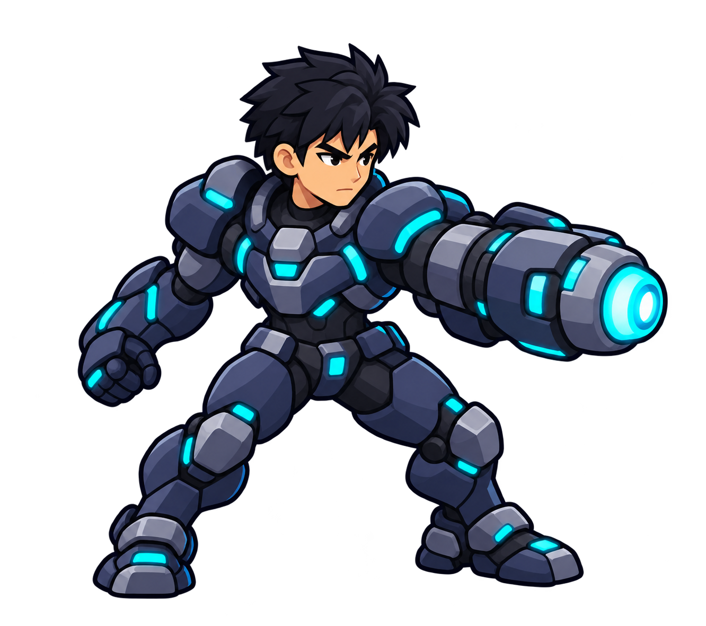

# 凯尔侧面造型候选（P0a）

- 来源：2026-09-30，按 `reference-a.png` 的圆整结实造型、`reference-b-lighting.png` 的局部亮度，以及现有 `char_kai.png` 的身份特征生成。第三轮删减过密装甲纹理后保留此版。
- 身份锁定：黑色短发、深海军蓝与炭色大块装甲、青色海克斯能量、右臂一体化炮、清楚的发光炮口；左手为空手。全身只有两臂两腿。
- 方向与动作基准：俯视倾斜的右向三分之四视角，重心落在双脚之间；炮口朝画面右侧。后续前、背视图应保持头身比例、炮身三段结构、肩甲/膝甲大块形状与发光位置。
- 文件核验：1332×1181 RGBA，Alpha 同时包含 0 和 255；以 Alpha>128 计算的不透明边界为 `(147,82)–(1260,1129)`。82px 高度预览时可认出头部、双腿和炮口。
- 使用边界：这张是设计候选，不是已切好的运行时精灵。当前 `char_token_kai*`、`char_kai` 和角色动画未替换；后续需拆出前后层级、关节与枪口挂点，完成动作样板并在 Cocos 82px 尺寸下验收。
